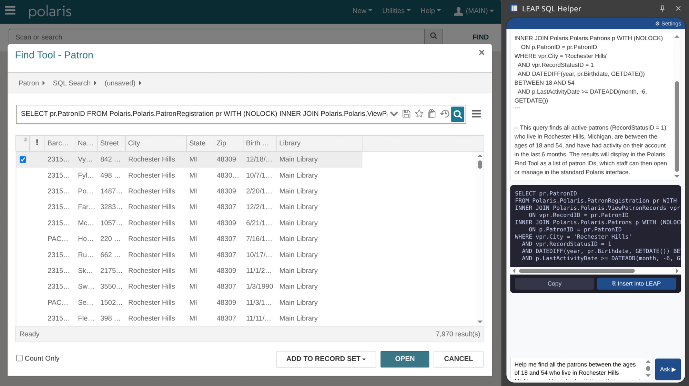

# Polaris LEAP SQL — Local AI Assistant Resources

Community resources from **Rochester Hills Public Library (RHPL)** for Polaris ILS libraries
that want to run an AI SQL assistant **entirely on their own hardware** — no cloud, no vendor
API, no patron data leaving the building.

These files are the knowledge base and system prompts that power RHPL's self-hosted assistant.
The full setup guide is in [`polaris-qwen-guide.md`](polaris-qwen-guide.md).

---

## What This Is

Rochester Hills Public Library built a local AI assistant that helps library staff search and
report against the Polaris database. Staff type a question in plain English — "find all patrons
with holds but no checkouts in the last two years" or "show me items in lost status older than
90 days" — and the assistant returns a working SQL query, ready to paste into the Polaris Find
Tool, SSMS, or any reporting tool.

**No SQL knowledge is required.** The model understands the Polaris 8.0 database schema,
knows the rules of Find Tool SQL (no semicolons, `WITH (NOLOCK)` placement, SELECT DISTINCT
with primary key fields, no subqueries), and generates queries that work correctly the first
time.

### Why we built it locally

ILS vendors, including Clarivate, are beginning to build AI features into their products using
cloud-based large language models — meaning staff questions, patron data, and query context
flow through third-party servers like OpenAI's ChatGPT infrastructure. RHPL's approach is
different: the model runs on a GPU inside our building. Patron records, staff queries, and
everything the model sees stay inside RHPL's network.

There are no per-query API fees and no vendor subscription for AI access. The only cost is
the hardware, which RHPL already owns and operates.

### What this repository contains

This repository holds the files that make the assistant work:

- **`schema/`** — Polaris 8.0 database schema files loaded into the model as a knowledge base
- **`sql-queries/`** — Hundreds of working SQL queries organized by functional area, used
  as examples so the model understands correct query patterns
- **`prompts/`** — System prompts that define the model's behavior for Find Tool searches
  and SSMS/reporting use

Any Polaris library with a modern GPU (NVIDIA with CUDA, or AMD with ROCm; 10 GB+ VRAM) can
replicate this setup. See [`polaris-qwen-guide.md`](polaris-qwen-guide.md) for full
installation and configuration instructions.

---

## LEAP SQL Helper — Chrome Extension

To make the assistant as frictionless as possible for staff, RHPL built a companion Chrome
extension that lives as a side panel inside the browser. Staff never leave Polaris LEAP to
use it.



### How it works

1. Staff open the **LEAP SQL Helper** side panel while working in Polaris LEAP
2. They type a plain-English question — *"find all patrons between 18 and 54 who live in
   Rochester Hills with activity in the last 6 months"*
3. The extension sends the question to RHPL's local AI (running on-premises at
   `localai.rhpl.org`) and receives back a complete SQL query with a plain-English
   explanation of what it does
4. Staff click **Insert into LEAP** — the extension injects the SQL directly into the Find
   Tool SQL input field and the search runs immediately

No copy-paste, no tab switching, no SQL knowledge required. The query goes from question
to results in seconds.

### How it was built

The extension is a Chrome Manifest V3 side panel extension. Key technical details:

- **Side panel API** — renders as a persistent panel alongside LEAP, not a popup that closes
  on click
- **API call** — `POST` to the local Open WebUI instance (`/api/chat/completions`) using
  the `polaris-sql-helper` model configured with the knowledge base and system prompts in
  this repository
- **SQL injection** — uses `chrome.scripting.executeScript` with a native value setter to
  trigger LEAP's React change detection and fire the search automatically
- **No external network calls** — the extension only communicates with `localai.rhpl.org`
  (the library's internal server); nothing leaves the building
- **Managed deployment** — distributed to all staff Chromebooks via Google Admin Console,
  force-installed to the Staff OU with policy-managed settings (API URL, model ID)

### For other libraries

The extension source is not yet published separately, but the architecture is straightforward
to replicate. You need:

1. A running Open WebUI instance with the `polaris-sql-helper` model configured (see
   [`polaris-qwen-guide.md`](polaris-qwen-guide.md))
2. A Chrome MV3 extension with the side panel API pointing at your internal Open WebUI URL
3. The SQL selector for the LEAP Find Tool input field:
   `#find-tool > div > div.erms-search-panel > div.erms-inline-form > div > div.erms-search-input > input`

The extension can be sideloaded during testing or distributed via Google Admin Console
for managed Chromebook fleets.

---

## Hardware Requirements

A GPU is required. RHPL runs **Qwen3-14B** on an AMD Radeon AI PRO R9700 (32 GB VRAM).

| Model | Min VRAM | Notes |
|-------|----------|-------|
| Qwen3-7B | ~10 GB | Faster; good SQL quality |
| Qwen3-14B | ~16 GB | Recommended — RHPL's current model |
| Qwen3-14B-AWQ | ~10–12 GB | Quantized; good if 16 GB is tight |
| Qwen3-32B-AWQ | ~22 GB | Higher quality; useful for complex reporting queries |

Any NVIDIA (CUDA) or AMD (ROCm) GPU will work. CPU-only inference is too slow for
interactive SQL generation.

---

## Repository Layout

```
polaris-qwen-guide.md    Full setup guide — start here
schema/                  Polaris 8.0 database schema reference files
sql-queries/             Example SQL queries organized by functional area
prompts/                 System prompts for Open WebUI model configuration
sync-to-repo.sh          Script to sync updated files from local build dirs
```

### `schema/` — Database Schema Reference

Load these files as a knowledge base in Open WebUI so the model understands table structures.

| File | Contents |
|------|----------|
| `polaris_core_tables.md` | Core tables quick reference with column descriptions — start here |
| `schema-lookup-values.md` | Lookup/code table values (status IDs, type IDs, patron codes, etc.) |
| `schema-view-definitions.md` | Key SQL view definitions |
| `schema-key-tables.md` | Annotated list of most important tables |
| `schema-columns-nullability.md` | Column nullability reference |
| `generating-your-schema.md` | **How to generate CREATE TABLE definitions from your own database** |

> **Note on CREATE TABLE files:** RHPL's CREATE TABLE schema files are not included here
> because they were generated from RHPL's live database and may not match your site's
> schema exactly. You should generate your own — see
> [`schema/generating-your-schema.md`](schema/generating-your-schema.md) for the SSMS
> query and instructions.

### `sql-queries/` — Example SQL by Functional Area

Hundreds of working SQL queries organized by functional area. Load alongside schema files.

| File | Contents |
|------|----------|
| `find-tool-reference.md` | Find Tool SQL syntax rules and confirmed patterns |
| `sql-patterns.md` | Common query patterns and anti-patterns |
| `patrons.md` | Patron record queries |
| `items.md` | Item record queries |
| `circulation.md` | Checkout, checkin, circulation history |
| `holds.md` | Hold requests and hold queue queries |
| `fines-accounts.md` | Fines and patron account queries |
| `notifications.md` | Notification and notice queries |
| `reporting.md` | Report-oriented queries |
| `cataloging.md` | Bibliographic and cataloging queries |
| `collection-management.md` | Collection management and weeding queries |
| `acquisitions.md` | Acquisitions queries |
| `administration.md` | Administrative and system queries |
| `data-management.md` | Data cleanup and maintenance queries |
| `ill.md` | Interlibrary loan queries |
| `bookmobile.md` | Bookmobile-specific queries |

### `prompts/` — System Prompts

| File | Contents |
|------|----------|
| `sql-system-prompts.md` | Two system prompts — one for Find Tool (LEAP), one for SSMS/reporting |

The prompts include RHPL-specific values (branch IDs, patron codes, lookup IDs).
**Adapt these to your library before use.** See the "Adapting for Your Library" section
in `polaris-qwen-guide.md`.

---

## How to Use These Files

### Load as an Open WebUI Knowledge Base

1. In Open WebUI, go to **Workspace → Knowledge → Create**
2. Upload all files from `schema/` and `sql-queries/` into a single knowledge base
   named "Polaris SQL Queries" (or similar)
3. In **Workspace → Models**, create or edit your SQL model
4. Under **Knowledge**, attach the knowledge base you created
5. Paste one of the system prompts from `prompts/sql-system-prompts.md` into the
   **System Prompt** field
6. Save the model

### Direct context injection

If using a different front-end or API client, concatenate the schema and SQL files
and include them as context in your system prompt or conversation.

---

## Using This at Your Library

This setup is designed to be replicated. The schema and query files are standard Polaris 8.0 —
the table and column names are the same across all Polaris sites. What you need to adapt:

- **RHPL-specific values** appear throughout the SQL examples and system prompts: city names,
  branch IDs, material type IDs, patron codes, and similar site-specific data. Audit and
  replace these before deploying. The system prompts in `prompts/sql-system-prompts.md`
  contain an "Adapting for Your Library" section with guidance.
- **Generate your own schema files.** The schema files here were pulled from RHPL's live
  Polaris 8.0 database. Your site may have custom tables, extended columns, or slightly
  different data. Use [`schema/generating-your-schema.md`](schema/generating-your-schema.md)
  to pull CREATE TABLE definitions directly from your own SQL Server instance.
- **All queries target Polaris 8.0** on SQL Server. Earlier versions may have schema
  differences, especially in acquisitions and patron tables.
- **Find Tool SQL has specific constraints** that differ from standard SSMS SQL: no
  semicolons, no subqueries, `WITH (NOLOCK)` placement rules, and `SELECT DISTINCT` with
  only the primary key field. See `sql-queries/find-tool-reference.md` for the full rule set.
- The `schema-lookup-values.md` file contains corrected status IDs verified against a
  live Polaris 8.0 database — several IDs differ from what the official documentation shows.

---

## Contributing

Pull requests welcome. If you have queries, schema notes, prompt improvements, or
corrections that would help other Polaris libraries, submit a PR or open an issue.

---

Rochester Hills Public Library — Rochester Hills, Michigan  
[rhpl.org](https://rhpl.org)
